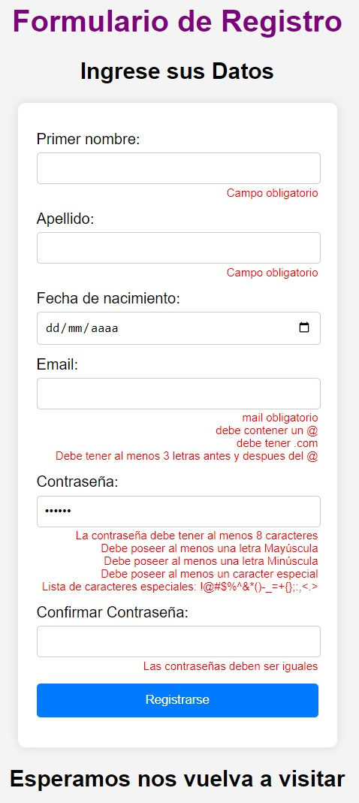

# Validaciones de un Formulario desde el Front

Pequeño proyecto para practicar validaciones desde el Front.

Desde JavaScript se capturan los elementos del HTML y se realizan validaciones desde el script en tiempo real, osea, 'on-time'. Esto se logra utilizando el evento 'blur'.

Nota: Para abrir el proyecto se usa la extensión "Live Server"

